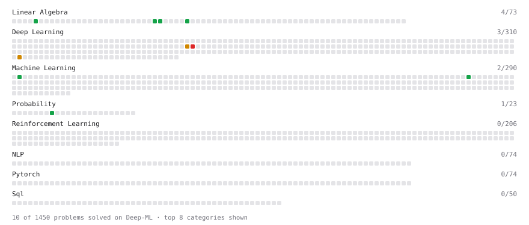

# Deep-ML

My machine learning practice from [Deep-ML](https://www.deep-ml.com). Every solution here was written by hand.

**6** solved · 4 problems · 0 labs · 2 math

[**Browse the interactive portfolio**](https://Varsity16.github.io/deep-ml/) to replay this filling in over time.

## Problems

| | Difficulty | Solved | |
| --- | --- | --- | --- |
| [Calculate Cosine Similarity Between Vectors](https://www.deep-ml.com/problems/76) | easy | 2026-09-23 | [solution](problems/0076-calculate-cosine-similarity-between-vectors) |
| [Dot Product Calculator](https://www.deep-ml.com/problems/83) | easy | 2026-09-23 | [solution](problems/0083-dot-product-calculator) |
| [Scalar Multiplication of a Matrix](https://www.deep-ml.com/problems/5) | easy | 2026-09-23 | [solution](problems/0005-scalar-multiplication-of-a-matrix) |
| [Vector Element-wise Sum](https://www.deep-ml.com/problems/121) | easy | 2026-09-23 | [solution](problems/0121-vector-element-wise-sum) |

## Math

| | Difficulty | Solved | |
| --- | --- | --- | --- |
| [Derivatives and Gradients](https://www.deep-ml.com/math-problems/1) | easy | 2026-09-23 | [solution](math/0001-derivatives-and-gradients) |
| [Gradient Descent Updates](https://www.deep-ml.com/math-problems/5) | easy | 2026-09-23 | [solution](math/0005-gradient-descent-updates) |

---

_This file is regenerated by Deep-ML on every push._
